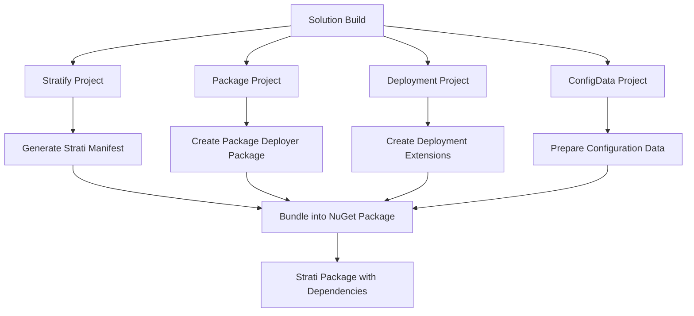
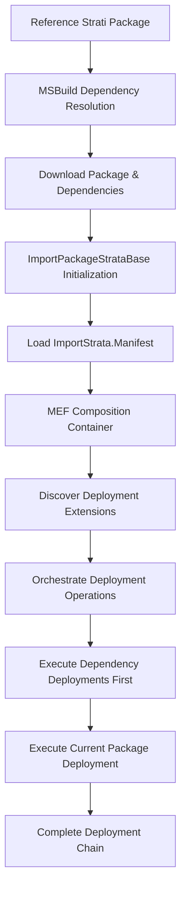
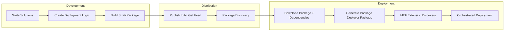

# How OpenStrata Works: Under the Hood

This document explains the technical implementation of OpenStrata's revolutionary **Strati package system** - how Strati packages are produced, consumed, and deployed to bring NuGet-style package management to the Power Platform ecosystem.

## 🎯 Overview: The OpenStrata Architecture

OpenStrata extends Microsoft's **Power Platform Package Deployer** framework to enable dependency-aware deployment of Power Platform capabilities. At its core, OpenStrata transforms the traditional Package Deployer from a single-package deployment tool into a **dependency-resolving package ecosystem**.

### Key Innovation: Extending CrmPackageExtension

OpenStrata's breakthrough comes from extending the `CrmPackageExtentionBase.ImportExtension` class to create `ImportPackageStrataBase`, which adds **System.ComponentModel.Composition (MEF)** support for discovering and orchestrating multiple Strati packages and their deployment operations.

## 🏗️ Part 1: How Strati Packages Are Produced

### The Build Process Flow

When you build an OpenStrata solution, multiple coordinated MSBuild projects work together to create Strati packages:



### 1. MSBuild.Stratify: The Core Package Builder

**File**: `MSBuild.Stratify.targets`

The Stratify project orchestrates the entire Strati package creation process:

- **GenerateStratiManifest**: Creates a manifest describing the package contents, dependencies, and metadata
- **GenerateBuildTransitiveProps**: Creates MSBuild props/targets that are automatically imported by consuming projects
- **CreateStrati**: Bundles everything into a NuGet package with special MSBuild integration

**Key MSBuild Tasks**:
```xml
<UsingTask TaskName="GenerateStratiManifest" />
<UsingTask TaskName="GenerateBuildTransitiveProps" />
<UsingTask TaskName="GenerateStrataStratifyManifest" />
```

**What Gets Packaged**:
- Solution files from Solution projects
- Configuration data from ConfigData projects  
- Deployment assemblies from Deployment projects
- Package deployer configurations from Package projects
- Dependency metadata for other Strati packages

### 2. MSBuild.Package: Power Platform Package Deployer Integration

**File**: `MSBuild.Package.targets`

The Package project creates **Power Platform Package Deployer packages** that extend the `CrmPackageExtentionBase`:

- **GenerateImportPackagePartialClass**: Creates C# code that extends `ImportPackageStrataBase`
- **CreateImportStrataManifest**: Creates deployment manifests for Strati dependencies
- **CreateEditableImportPackageClassFile**: Generates developer-customizable deployment logic

**Key Integration Points**:
```csharp
// Generated class extends OpenStrata base
public partial class ImportPackage : ImportPackageStrataBase
{
    // Auto-generated deployment logic
    // Developer can override in ImportPackage.cs
}
```

### 3. MSBuild.Deployment: Composable Deployment Operations

**File**: `MSBuild.Deployment.targets`

Deployment projects create **MEF-discoverable extensions** that handle specific deployment operations:

```csharp
[Export(typeof(IImportPackageStratiExtension))]
public class MyDeploymentExtension : IImportPackageStrataExtension
{
    // Custom deployment logic
    public bool BeforeImportStage() { /* ... */ }
    public bool AfterPrimaryImport() { /* ... */ }
}
```

**What This Enables**:
- Developers write deployment logic in Deployment projects
- No need to modify Package Deployer projects directly
- Automatic discovery and orchestration via MEF composition

### 4. Manifest Generation: Dependency Declaration

**Strati Manifest Structure**:
```xml
<StrataManifest>
  <Strata PackageId="ContosoCore.Strati" Version="1.2.0">
    <Dependencies>
      <Dependency PackageId="ContosoSecurity.Strati" Version="1.0.0" />
    </Dependencies>
    <Solutions>
      <Solution Path="ContosoCore_1_0_0_1_managed.zip" />
    </Solutions>
    <ConfigData>
      <ConfigPackage Path="ReferenceData.zip" />
    </ConfigData>
    <DeploymentExtensions>
      <Extension Assembly="ContosoCore.Deployment.dll" />
    </DeploymentExtensions>
  </Strata>
</StrataManifest>
```

## 📦 Part 2: How Strati Packages Are Consumed

### The Consumption and Deployment Flow

When a Strati package is referenced and deployed, OpenStrata orchestrates dependency resolution and deployment:



### 1. MSBuild Integration: Automatic Package Download

When you reference a Strati package in your project:

```xml
<PackageReference Include="ContosoCore.Strati" Version="1.2.0" />
```

**MSBuild automatically**:
- Downloads the Strati package and all its dependencies
- Imports the package's build props/targets via `buildTransitive` folder
- Makes package contents available during your build process

### 2. ImportPackageStrataBase: Enhanced Package Deployer

**File**: `ImportPackageStrataBase.cs`

This is where the magic happens. When a Package Deployer package that extends `ImportPackageStrataBase` is deployed:

```csharp
public abstract class ImportPackageStrataBase : ImportExtension
{
    // MEF composition for discovering extensions
    private ImportPackageStrataExtensionsFactory _extensionFactory;
    
    // Strati manifest handling
    private ImportStrataManifestXDocument _stratamanifest;
    
    // Orchestrates all deployment operations
    protected virtual void ExecuteDeploymentChain()
    {
        // 1. Load ImportStrata.Manifest
        // 2. Resolve dependencies
        // 3. Execute deployment extensions in order
    }
}
```

### 3. MEF Composition: Dynamic Extension Discovery

**File**: `ImportPackageStrataExtensionsFactory.cs`

OpenStrata uses **System.ComponentModel.Composition** to automatically discover and load deployment extensions:

```csharp
public class ImportPackageStrataExtensionsFactory
{
    // MEF container for discovering extensions
    CompositionContainer ImportPackageStrataExtensionsContainer;
    
    [ImportMany(typeof(IImportPackageStrataFeatureExtension))]
    public IEnumerable<IImportPackageStrataFeatureExtension> FeatureExtensions;
    
    [ImportMany(typeof(IImportPackageStratiExtension))]  
    public IEnumerable<IImportPackageStratiExtension> StratiExtensions;
    
    public List<IImportPackageStrataExtension> InstantiateExtensions(ImportPackageStrataBase package)
    {
        // Creates DirectoryCatalog to scan for deployment extensions
        // Composes all discovered extensions
        // Returns ordered list for execution
    }
}
```

### 4. Dependency Resolution and Orchestration

**The Deployment Sequence**:

1. **Parse ImportStrata.Manifest**: Discovers all Strati dependencies and their deployment requirements
2. **Dependency Resolution**: Ensures all required Strati packages are available and compatible
3. **Extension Discovery**: Uses MEF to find all `IImportPackageStratiExtension` implementations
4. **Ordered Execution**: Deploys dependencies first, then current package
5. **Lifecycle Hooks**: Executes `BeforeImportStage`, `AfterPrimaryImport`, etc. across all extensions

### 5. Developer Experience: Seamless Integration

**For Package Developers**:
- Write deployment logic in Deployment projects using familiar C# interfaces
- Automatic MEF export attributes enable discovery
- No direct Package Deployer project modification needed

**For Package Consumers**:
- Simple NuGet package references automatically resolve dependencies
- Standard Package Deployer tools work transparently
- Dependency chain deployment happens automatically

## 🔄 Part 3: The Complete Lifecycle

### Development → Distribution → Deployment



### Key Technical Innovations

1. **Extending Package Deployer**: `ImportPackageStrataBase` adds dependency awareness to the existing Power Platform deployment framework

2. **MEF Composition**: Automatic discovery and orchestration of deployment operations without manual configuration

3. **MSBuild Integration**: Seamless NuGet package management with automatic dependency resolution

4. **Manifest-Driven Deployment**: Declarative deployment orchestration through Strati manifests

5. **Transitive Dependencies**: Full dependency chain resolution and deployment, just like NuGet packages

## 🎯 Why This Architecture Works

### Familiar Patterns
- **NuGet Model**: Developers already understand package references and dependency management
- **MEF Composition**: Standard .NET pattern for extensible applications
- **MSBuild Integration**: Leverages existing .NET build infrastructure

### Power Platform Integration  
- **Package Deployer Foundation**: Built on Microsoft's established deployment framework
- **No Breaking Changes**: Existing Package Deployer tools continue to work
- **Enterprise Ready**: Supports existing ALM processes and tools

### Developer Experience
- **Separation of Concerns**: Deployment logic lives in Deployment projects, not Package projects
- **Composable Operations**: Multiple Deployment projects can contribute to a single package
- **Automatic Orchestration**: No manual configuration of deployment sequences

---

**The Result**: OpenStrata transforms Power Platform development from a "copy-paste" model to a true **package ecosystem** with dependency management, reusable components, and enterprise-grade deployment automation - all while maintaining full compatibility with existing Power Platform ALM practices.